  <!-- HERO: typewriter animation -->
  
    

  <!-- Optional: если хочешь оставить превью-картинку сверху, оставь этот блок -->
  <!--
  
    
  -->

  
    

  <!-- ABOUT -->
  
    
  
    

  
    

  <!-- STACK -->
  
    
  
    

  
    

  <!-- CONTACT -->
  
    

  

    
  
    

  <!-- PINNED -->
  
    

  <!-- Projects grid (2 columns) -->
  

    
    &nbsp;
    
  

  

    
    &nbsp;
    
  

  

    
    &nbsp;
    
  

   

